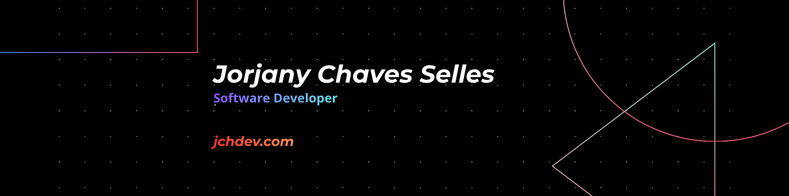
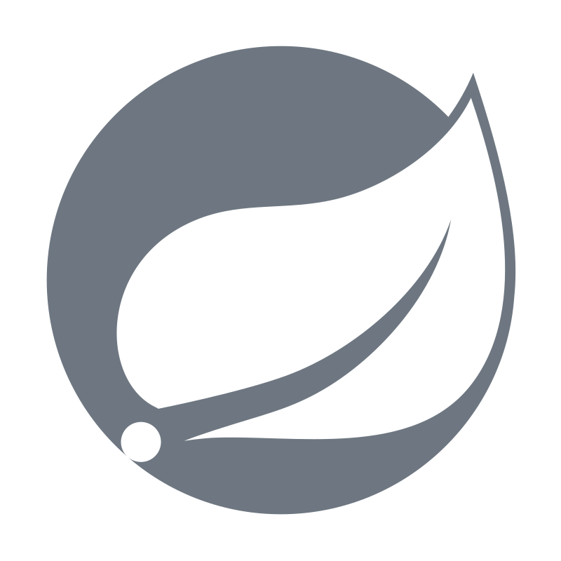
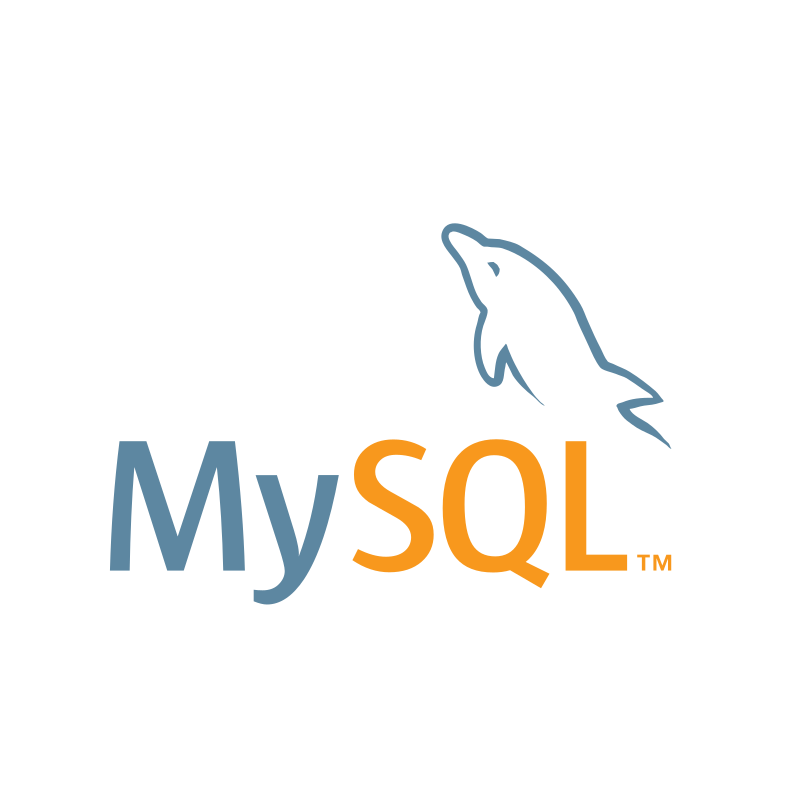

  
  

  
  &nbsp;&nbsp;
  

## About Me

I'm Jorjany Chaves Selles, a software developer focused on backend development. My background in Business Informatics has allowed me to approach software development by combining programming, data and business needs.

I currently develop personal projects where I continue strengthening my skills in web development, databases and backend technologies.

A cup of coffee is usually somewhere between the idea and the code.

## Tech Stack

### Backend

  
  &nbsp;&nbsp;
  
  

### Database

  

### Frontend

  
  &nbsp;&nbsp;
  

<!--
**jorjanyCh/jorjanyCh** is a ✨ _special_ ✨ repository because its `README.md` (this file) appears on your GitHub profile.

Here are some ideas to get you started:

- 🔭 I’m currently working on ...
- 🌱 I’m currently learning ...
- 👯 I’m looking to collaborate on ...
- 🤔 I’m looking for help with ...
- 💬 Ask me about ...
- 📫 How to reach me: ...
- 😄 Pronouns: ...
- ⚡ Fun fact: ...
-->
